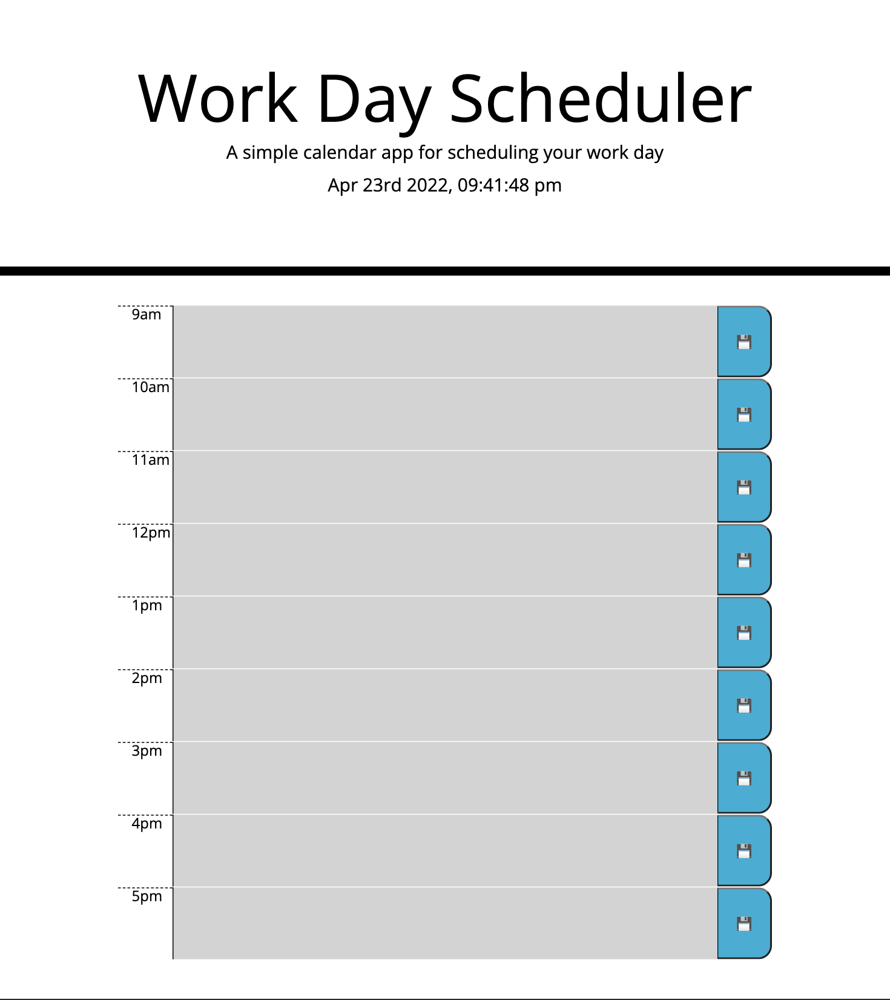

# daily-planner
This is a jQuery based daily planner app.

Using the moment.js API allows you to change the color of the time rows based on the current time of day. It also allows for updating the current time and date at the top of the page.

I set up each time block with a time element, a text area element, and a save button.

moment.js is also used to determine the color of each column based on the time of day by applying and removing class names to each row.

.on was used to make the save buttons function to store the text area input in the local storage.

Then a for loop was used to retrieve stored data to display when the page is refreshed or revisited.

https://monacoglynn.github.io/daily-planner/

